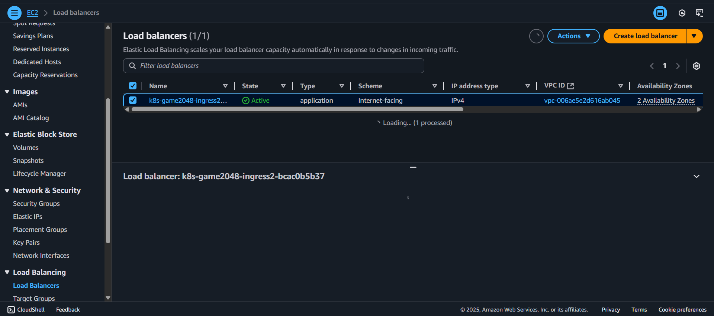
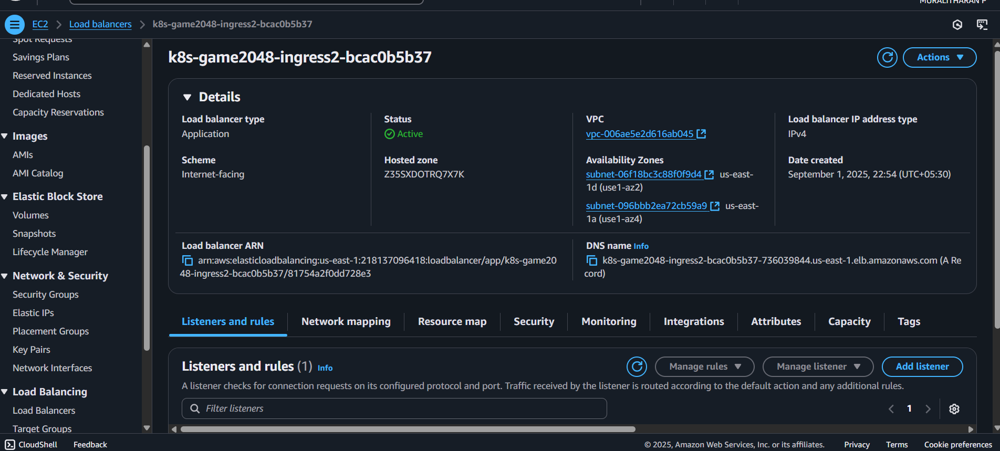

# Amazon EKS Project with Fargate, Ingress & ALB Controller  

This project demonstrates the setup of an **Amazon EKS Cluster** with **Fargate profiles**, **Ingress Controller (ALB Controller)**, and **OIDC integration** for secure IAM role-based access.  

## ⚙️ Step 1: Create an EKS Cluster  
We create an EKS cluster using `eksctl`. This automatically provisions VPC, subnets (public & private), and networking components.  

```bash
eksctl create cluster --name my-cluster --region us-east-1 --fargate
```


## Step 2: Create a Fargate Profile

Fargate allows us to run pods without managing EC2 nodes. Create a profile for specific namespaces.


## Step 3: Configure Identity Provider (OIDC)

Enable OIDC identity provider to integrate IAM roles with Kubernetes service accounts.


## Step 4: Create IAM Policy and Role

Create an IAM policy for ALB Controller and attach it to the service account.


## Step 5: Attach Role to Service Account

Link the IAM role with Kubernetes Service Account for pod-level access.


## Step 6: Install the ALB Ingress Controller

Now install the AWS Load Balancer (ALB) Controller via Helm. This will manage Ingress resources and create an ALB automatically.







